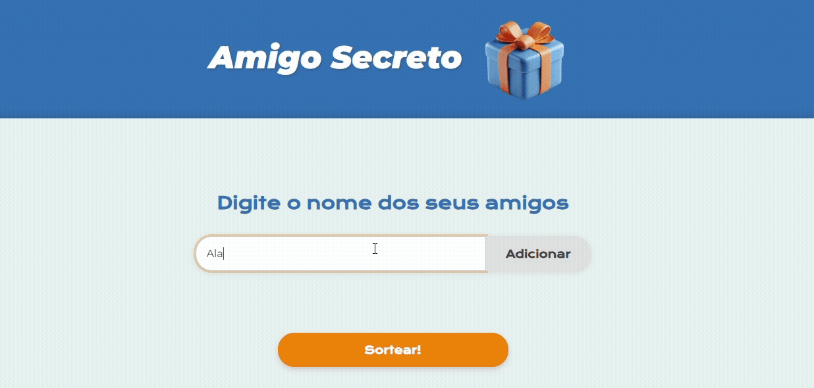

<h1 align="center"> Sorteio de Amigo Secreto | Challenge ONE   </h1>

Projeto desenvolvido para o Challenge da Alura | ONE para conclusão do módulo Iniciante em Programação G9. A aplicação web recebe os nomes dos participantes, realiza o Sorteio de Amigo Secreto e revela os nomes individualmente. 

# ✳️ Funcionalidades do projeto
- `Adição dinâmica`: Ao clicar em "Adicionar", o nome é incluído na lista de participantes. O sistema impede a adição de nomes vazios ou duplicados e é possível remover um participante a qualquer momento.
- `Algoritmo de Sorteio`: O sorteio só pode ser realizado com um mínimo de 3 participantes e garante que ninguém sorteará a si mesmo.
- `Revelação Individual Controlada`: Após o sorteio, surge a seção de revelação, no qual o nome sorteado é visível somente enquanto o botão estiver pressionado.
- `Design Responsivo`: A interface foi construída para se adaptar a diferentes tamanhos de tela.

# 💻 Tecnologias Utilizadas
HTML5 | CSS3 | Flexbox | Media Queries | JavaScript
